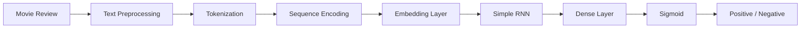

# 🧠 Simple RNN — IMDB Sentiment Analysis

<p align="center">


</p>

<p align="center">
  <b>End-to-End Natural Language Processing Project using Simple Recurrent Neural Networks</b>
</p>

---

## 📌 Overview

**Simple RNN — IMDB Sentiment Analysis** is an NLP deep learning project that classifies movie reviews as either **Positive** or **Negative** using a **Simple Recurrent Neural Network (RNN)**.

The project covers the complete pipeline:

```text
Raw Text
   ↓
Text Preprocessing
   ↓
Tokenization
   ↓
Sequence Encoding
   ↓
Word Embedding
   ↓
Simple RNN
   ↓
Binary Classification
   ↓
Sentiment Prediction
```

The objective is to understand how recurrent neural networks process sequential text and learn patterns that indicate sentiment.

---

## 🎯 Problem Statement

Given a movie review, the model needs to determine whether the review expresses a **positive** or **negative** sentiment.

### Example

```text
Input:
"The movie was absolutely fantastic and the acting was brilliant."

Output:
🟢 Positive
```

```text
Input:
"The movie was extremely boring and disappointing."

Output:
🔴 Negative
```

---

## 🧩 Project Architecture

<p align="center">



</p>

---

## 🏗️ Model Architecture

The neural network follows a sequence-processing architecture:

```text
Input Text
     │
     ▼
Tokenization
     │
     ▼
Embedding Layer
     │
     ▼
Simple RNN
     │
     ▼
Dense Layer
     │
     ▼
Sigmoid Activation
     │
     ▼
Sentiment
```

### Main Components

| Component           | Purpose                                    |
| ------------------- | ------------------------------------------ |
| **Tokenizer**       | Converts words into numerical tokens       |
| **Padding**         | Makes sequences equal in length            |
| **Embedding Layer** | Converts tokens into dense vectors         |
| **Simple RNN**      | Learns sequential relationships            |
| **Dense Layer**     | Performs final classification              |
| **Sigmoid**         | Produces binary classification probability |

---

## 📊 Dataset

The project uses the **IMDB Movie Reviews dataset**, a standard benchmark dataset for sentiment classification.

The task is binary classification:

| Label | Sentiment   |
| ----: | ----------- |
|   `0` | 🔴 Negative |
|   `1` | 🟢 Positive |

The model learns linguistic patterns from movie reviews and uses those patterns to predict the sentiment of unseen text.

---

## 📂 Project Structure

```text
NLP-RNN-PROJECT/
│
├── 📓 embedding.ipynb
│
├── 📓 simplernn.ipynb
│
├── 📓 prediction.ipynb
│
├── 🐍 main.py
│
├── 📦 requirements.txt
│
├── 🧠 simple_rnn_imdb.h5
│
└── 📖 README.md
```

### File Description

| File                 | Description                                   |
| -------------------- | --------------------------------------------- |
| `embedding.ipynb`    | Text representation and embedding experiments |
| `simplernn.ipynb`    | RNN model development and training            |
| `prediction.ipynb`   | Sentiment prediction using the trained model  |
| `main.py`            | Python inference workflow                     |
| `requirements.txt`   | Project dependencies                          |
| `simple_rnn_imdb.h5` | Trained Simple RNN model                      |
| `README.md`          | Project documentation                         |

---

# 🔬 NLP Pipeline

## 1️⃣ Text Preprocessing

Raw movie reviews are converted into a format suitable for machine learning.

```text
Raw Text
   ↓
Cleaning
   ↓
Tokenization
   ↓
Numerical Representation
```

---

## 2️⃣ Tokenization

Words are converted into integer IDs.

```text
"this movie is amazing"

        ↓

[45, 231, 18, 892]
```

Each unique word is mapped to a numerical representation.

---

## 3️⃣ Sequence Padding

Reviews can have different lengths, so sequences are padded to a fixed length.

```text
Review A → [12, 45, 89, 23]

Review B → [17, 91]

After Padding →

Review A → [12, 45, 89, 23]
Review B → [17, 91,  0,  0]
```

---

## 4️⃣ Word Embeddings

The embedding layer transforms integer tokens into dense numerical vectors.

```text
Word ID
   ↓
Embedding Layer
   ↓
Dense Vector Representation
```

This allows the neural network to learn meaningful representations of words.

---

## 5️⃣ Simple RNN

The RNN processes the sequence step-by-step while maintaining information from previous words.

```text
Word₁ → Word₂ → Word₃ → Word₄
  ↓       ↓       ↓       ↓
 h₁  →   h₂  →   h₃  →   h₄
                    ↓
              Final State
                    ↓
              Classification
```

This sequential processing makes RNNs suitable for text and other sequential data.

---

# 🚀 Installation

Clone the repository:

```bash
git clone https://github.com/24f2006816/NLP-RNN-PROJECT.git
```

Navigate to the project:

```bash
cd NLP-RNN-PROJECT
```

Create a virtual environment:

```bash
python -m venv venv
```

### Linux / macOS

```bash
source venv/bin/activate
```

### Windows

```bash
venv\Scripts\activate
```

Install dependencies:

```bash
pip install -r requirements.txt
```

---

# ▶️ Running the Project

### Using Jupyter Notebook

```bash
jupyter notebook
```

Run the notebooks in this order:

```text
1. embedding.ipynb
2. simplernn.ipynb
3. prediction.ipynb
```

### Using Python

```bash
python main.py
```

---

# 🧪 Example Predictions

### 🟢 Positive Review

```text
"This movie was fantastic. The story was engaging
and the performances were excellent."
```

**Prediction:**

```text
Positive
```

---

### 🔴 Negative Review

```text
"The movie was boring, poorly written and
not worth watching."
```

**Prediction:**

```text
Negative
```

---

# 📈 Key Concepts

This project demonstrates practical implementation of:

* Natural Language Processing
* Text preprocessing
* Tokenization
* Sequence encoding
* Padding
* Word embeddings
* Recurrent Neural Networks
* Simple RNN
* Binary classification
* Sentiment analysis
* Deep learning
* Model training
* Model inference

---

# 🧠 What I Learned

Through this project, I explored:

* How machines represent natural language numerically
* How tokenization works
* Why sequence padding is required
* How word embeddings represent words
* How RNNs process sequential information
* How neural networks can perform sentiment classification
* How a trained model can be used for inference

---

# 🔮 Future Improvements

The current Simple RNN architecture can be extended to more advanced NLP architectures:

```text
Simple RNN
    │
    ├── LSTM
    │
    ├── GRU
    │
    ├── Bidirectional RNN
    │
    ├── Attention
    │
    └── Transformers
            │
            ├── BERT
            ├── DistilBERT
            └── Modern LLMs
```

Potential improvements:

* Hyperparameter tuning
* Better preprocessing
* LSTM/GRU implementation
* Bidirectional RNN
* Attention mechanism
* Transformer-based sentiment classification
* REST API
* Streamlit interface
* Docker deployment
* Cloud deployment
* Model performance visualization

---

# 🛠️ Tech Stack

<p align="center">


</p>

---

# 👨‍💻 Author

### Pratyaksh Pandey

**IIT Madras — BS in Data Science and Applications**

GitHub:
https://github.com/24f2006816

---

# ⭐ If You Find This Project Useful

If this project helped you understand **RNNs, NLP, or sentiment analysis**, consider giving the repository a ⭐.

---

## 📜 License

This project is created for **educational and learning purposes**.
