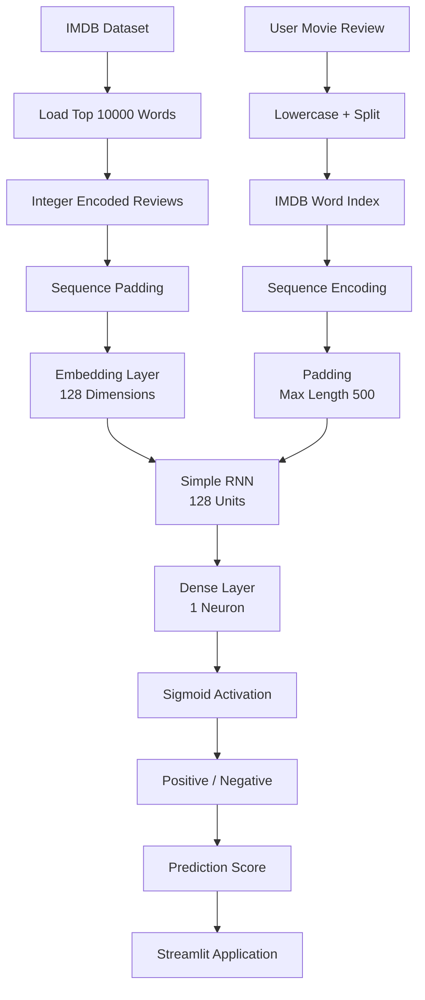

# IMDB Movie Review Sentiment Analysis — Simple RNN


---

🔗 **GitHub Repository:** https://github.com/24f2006816/NLP-RNN-PROJECT

---

## Project Overview

This project implements an end-to-end **Natural Language Processing sentiment classification workflow using a Simple Recurrent Neural Network (RNN)**.

The system takes an IMDB movie review as input and predicts whether the review expresses a **positive** or **negative** sentiment.

The project covers the complete deep learning lifecycle:

**IMDB dataset → word indexing → sequence padding → word embedding → Simple RNN training → model serialization → inference → Streamlit application**

The classification target is the sentiment label provided by the **IMDB movie review dataset**.

### What makes this more than a basic RNN notebook

* The project uses the built-in **IMDB dataset** provided by TensorFlow/Keras.
* A vocabulary of the **10,000 most frequent words** is used for the model.
* Reviews are converted into numerical sequences using the IMDB word index.
* Variable-length reviews are padded to a fixed length of **500 tokens**.
* A dedicated **Embedding layer** converts token IDs into dense vector representations.
* A **SimpleRNN** layer processes the sequential text representation.
* **Early stopping** is used during model training.
* The trained model is serialized as `simple_rnn_imdb.h5`.
* A separate prediction workflow preprocesses new user-provided reviews using the same vocabulary representation.
* A **Streamlit application** provides an interactive interface for real-time sentiment prediction.

---

## Key Features

* **End-to-end NLP pipeline** — preprocessing, sequence encoding, embedding, training, evaluation, and inference
* **IMDB dataset** — built-in TensorFlow/Keras movie review dataset
* **Vocabulary limitation** — model uses the top `10,000` words
* **Sequence padding** — reviews are standardized to a maximum length of `500`
* **Word embeddings** — token IDs are transformed into 128-dimensional representations
* **Simple RNN architecture** — recurrent layer with 128 units
* **Binary classification** — sigmoid output for positive/negative sentiment
* **Early stopping** — training uses an early-stopping callback
* **Saved Keras model** — trained model stored as `simple_rnn_imdb.h5`
* **Prediction pipeline** — new reviews are encoded and padded before inference
* **Prediction probability** — application displays the prediction score
* **Streamlit inference application** — interactive movie-review sentiment classifier

---

## Machine Learning Workflow



### Stage-by-Stage Summary

| Stage                       | What happens                                                         |
| --------------------------- | -------------------------------------------------------------------- |
| **Dataset**                 | IMDB movie reviews are loaded using `tensorflow.keras.datasets.imdb` |
| **Vocabulary**              | The top 10,000 most frequent words are used                          |
| **Word Index**              | IMDB's predefined word-to-integer mapping is used                    |
| **Sequence Representation** | Reviews are represented as integer sequences                         |
| **Padding**                 | Sequences are padded to a maximum length of 500                      |
| **Embedding**               | Token IDs are converted into 128-dimensional vectors                 |
| **RNN Processing**          | A Simple RNN with 128 units processes the sequence                   |
| **Classification**          | A Dense layer with sigmoid activation produces the output            |
| **Training**                | Model is trained using Adam and binary crossentropy                  |
| **Training Control**        | Early stopping is used during training                               |
| **Serialization**           | Trained model is saved as `simple_rnn_imdb.h5`                       |
| **Prediction**              | New reviews are encoded, padded, and passed to the trained model     |
| **Application**             | Streamlit provides an interactive sentiment prediction interface     |

---

## Model Architecture

The primary model is implemented using **TensorFlow/Keras Sequential API**.

```text
Input Review
     │
     ▼
IMDB Word Index
     │
     ▼
Sequence Encoding
     │
     ▼
Padding
Max Length = 500
     │
     ▼
Embedding Layer
128 Dimensions
     │
     ▼
Simple RNN
128 Units
ReLU
     │
     ▼
Dense Layer
1 Neuron
Sigmoid
     │
     ▼
Sentiment Probability
     │
     ├──────────────┐
     ▼              ▼
Positive         Negative
```

### Configuration

| Component               | Configuration       |
| ----------------------- | ------------------- |
| Framework               | TensorFlow / Keras  |
| Architecture            | Sequential          |
| Vocabulary Size         | 10,000              |
| Maximum Sequence Length | 500                 |
| Embedding Dimension     | 128                 |
| RNN Layer               | SimpleRNN           |
| RNN Units               | 128                 |
| RNN Activation          | ReLU                |
| Output Layer            | 1 neuron            |
| Output Activation       | Sigmoid             |
| Optimizer               | Adam                |
| Loss                    | Binary Crossentropy |
| Metric                  | Accuracy            |
| Maximum Epochs          | 10                  |
| Batch Size              | 32                  |
| Validation Split        | 20%                 |
| Training Control        | Early Stopping      |

---

## Word Embedding

The project contains a dedicated notebook:

```text
embedding.ipynb
```

This notebook demonstrates how words can be represented as numerical vectors using an embedding layer.

The basic workflow is:

```text
Text
  ↓
One-Hot / Integer Representation
  ↓
Padding
  ↓
Embedding Layer
  ↓
Dense Vector Representation
```

The embedding layer used in the primary RNN model contains:

```text
Vocabulary Size = 10,000
Embedding Dimension = 128
```

This allows the neural network to learn numerical representations of the words used in the movie reviews.

---

## Simple RNN

The main model is implemented in:

```text
simplernn.ipynb
```

The model architecture is:

```python
model = Sequential()

model.add(
    Embedding(
        max_features,
        128,
        input_length=max_len
    )
)

model.add(
    SimpleRNN(
        128,
        activation="relu"
    )
)

model.add(
    Dense(
        1,
        activation="sigmoid"
    )
)
```

The model is compiled using:

```python
model.compile(
    optimizer="adam",
    loss="binary_crossentropy",
    metrics=["accuracy"]
)
```

---

## Dataset

The project uses the **IMDB Movie Reviews dataset** available through TensorFlow/Keras.

The dataset is loaded using:

```python
from tensorflow.keras.datasets import imdb

(X_train, y_train), (X_test, y_test) = imdb.load_data(
    num_words=10000
)
```

The dataset contains movie reviews represented as integer sequences.

The sentiment labels are binary:

| Label | Sentiment |
| ----: | --------- |
|   `0` | Negative  |
|   `1` | Positive  |

---

## Sequence Processing

Movie reviews naturally have different lengths.

For example:

```text
Review A → [12, 45, 89, 23]
Review B → [17, 91]
Review C → [32, 18, 77, 92, 14, 53]
```

The project standardizes these sequences using:

```python
sequence.pad_sequences(
    X_train,
    maxlen=500
)
```

After padding:

```text
Review A → [12, 45, 89, 23,  0,  0]
Review B → [17, 91,  0,  0,  0,  0]
Review C → [32, 18, 77, 92, 14, 53]
```

The actual model uses:

```text
Maximum Sequence Length = 500
```

---

## Training

The Simple RNN is trained using:

```python
history = model.fit(
    X_train,
    y_train,
    epochs=10,
    batch_size=32,
    validation_split=0.2,
    callbacks=[earlystopping]
)
```

### Training Configuration

| Parameter        |               Value |
| ---------------- | ------------------: |
| Epochs           |                  10 |
| Batch Size       |                  32 |
| Validation Split |                 20% |
| Optimizer        |                Adam |
| Loss             | Binary Crossentropy |
| Metric           |            Accuracy |
| Early Stopping   |             Enabled |

---

## Early Stopping

The training workflow uses an early-stopping callback.

The purpose is to stop training when validation performance stops improving rather than continuing unnecessarily for all available epochs.

The best model weights can therefore be retained during training.

---

## Model Serialization

After training, the model is saved as:

```text
simple_rnn_imdb.h5
```

The model can then be loaded without retraining:

```python
from tensorflow.keras.models import load_model

model = load_model(
    "simple_rnn_imdb.h5"
)
```

This saved model is used by both the prediction notebook and Streamlit application.

---

## Prediction Pipeline

The prediction workflow is implemented in:

```text
prediction.ipynb
```

The complete inference process is:

```text
User Review
     ↓
Lowercase Text
     ↓
Split Into Words
     ↓
IMDB Word Index
     ↓
Integer Encoding
     ↓
Padding
     ↓
Trained Simple RNN
     ↓
Prediction Score
     ↓
Sentiment
```

### Prediction Function

The project classifies the review using a probability threshold:

```python
sentiment = (
    "Positive"
    if prediction[0][0] > 0.5
    else "Negative"
)
```

Therefore:

```text
Prediction > 0.5 → Positive
Prediction ≤ 0.5 → Negative
```

---

## Input Processing

For a new review:

```text
"This movie was fantastic!"
```

The text is first converted to lowercase and split into words.

The words are then mapped using the IMDB word index.

Unknown words are represented using the project's unknown-word handling.

Finally, the resulting sequence is padded to:

```text
500 tokens
```

before being passed to the model.

---

## Streamlit Application

The project also includes a Streamlit application inside:

```text
main.py
```

The application provides an interactive interface:

```text
┌───────────────────────────────────────┐
│     IMDB Movie Review Sentiment       │
│              Analysis                 │
├───────────────────────────────────────┤
│                                       │
│  Enter Movie Review                   │
│  ┌───────────────────────────────────┐│
│  │ This movie was fantastic...       ││
│  │                                   ││
│  └───────────────────────────────────┘│
│                                       │
│             [ Classify ]              │
│                                       │
│  Sentiment: Positive                  │
│  Prediction Score: 0.XX               │
│                                       │
└───────────────────────────────────────┘
```

Run the application using:

```bash
streamlit run main.py
```

The application loads the trained model:

```text
simple_rnn_imdb.h5
```

and performs sentiment prediction on user-provided movie reviews.

---

## Project Architecture

```text
NLP-RNN-PROJECT/
│
├── embedding.ipynb
│   └── Word Embedding Representation
│
├── simplernn.ipynb
│   └── Dataset + Padding + Simple RNN Training
│
├── prediction.ipynb
│   └── Model Loading + Sentiment Prediction
│
├── main.py
│   └── Streamlit Application
│
├── simple_rnn_imdb.h5
│   └── Trained Simple RNN Model
│
├── requirements.txt
│   └── Python Dependencies
│
└── README.md
```

---

## Repository Components

### `embedding.ipynb`

Contains experiments related to word embedding representation.

The notebook demonstrates:

* Sequence representation
* Padding
* Embedding layer
* Vector representations

---

### `simplernn.ipynb`

Contains the primary model development workflow:

* IMDB dataset loading
* Vocabulary configuration
* Word-index inspection
* Sequence padding
* Embedding layer
* Simple RNN architecture
* Model compilation
* Model training
* Early stopping
* Model serialization

---

### `prediction.ipynb`

Contains the inference workflow:

* Loading the IMDB word index
* Loading the trained model
* Decoding reviews
* Preprocessing user input
* Padding input sequences
* Sentiment prediction
* Prediction score

---

### `main.py`

Contains the Streamlit application.

The application:

1. Loads the IMDB word index.
2. Loads `simple_rnn_imdb.h5`.
3. Accepts a movie review from the user.
4. Preprocesses the review.
5. Generates a prediction.
6. Converts the probability into Positive/Negative sentiment.
7. Displays the sentiment and prediction score.

---

## Tech Stack

| Layer                | Technology         |
| -------------------- | ------------------ |
| Language             | Python             |
| Deep Learning        | TensorFlow / Keras |
| NLP Dataset          | IMDB Movie Reviews |
| Neural Network       | Simple RNN         |
| Embeddings           | Keras Embedding    |
| Numerical Processing | NumPy              |
| Data Processing      | Pandas             |
| Visualization        | Matplotlib         |
| Monitoring           | TensorBoard        |
| Web Application      | Streamlit          |
| Model Serialization  | HDF5               |
| Development          | Jupyter Notebook   |

---

## Installation

**Prerequisites:** Python 3.x and `pip`

```bash
# 1. Clone the repository
git clone https://github.com/24f2006816/NLP-RNN-PROJECT.git

cd NLP-RNN-PROJECT

# 2. Create a virtual environment
python -m venv venv

# 3. Activate the environment
source venv/bin/activate

# Windows:
# venv\Scripts\activate

# 4. Install dependencies
pip install -r requirements.txt
```

---

## Running the Notebooks

Start Jupyter:

```bash
jupyter notebook
```

Then run the notebooks:

```text
embedding.ipynb
simplernn.ipynb
prediction.ipynb
```

The primary learning/training workflow is:

```text
embedding.ipynb
       ↓
simplernn.ipynb
       ↓
prediction.ipynb
```

---

## Running the Streamlit Application

After installing the dependencies:

```bash
streamlit run main.py
```

The application loads:

```text
simple_rnn_imdb.h5
```

and provides real-time sentiment classification.

---

## Example Prediction

### Input

```text
This movie was fantastic! The acting was great
and the plot was thrilling.
```

### Output

```text
Sentiment: Positive
Prediction Score: <model output>
```

The prediction score is generated directly by the trained sigmoid output layer.

---

## Model Artifacts

| Artifact             | Purpose                           |
| -------------------- | --------------------------------- |
| `simple_rnn_imdb.h5` | Trained Simple RNN model          |
| `embedding.ipynb`    | Embedding experiments             |
| `simplernn.ipynb`    | RNN training workflow             |
| `prediction.ipynb`   | Prediction and inference workflow |

---

## Key Learning Outcomes

This project demonstrates practical implementation of:

* Natural Language Processing
* Text representation
* Word indexing
* Sequence padding
* Word embeddings
* Recurrent Neural Networks
* Simple RNN architecture
* Binary classification
* Sigmoid activation
* Binary crossentropy
* Model training
* Early stopping
* Model serialization
* Model inference
* Streamlit application development

---

## Future Improvements

The current Simple RNN implementation can be extended with more advanced NLP architectures:

* LSTM
* GRU
* Bidirectional RNN
* Bidirectional LSTM
* Attention mechanisms
* Transformer architectures
* BERT
* DistilBERT

Additional improvements could include:

* Hyperparameter tuning
* Better text preprocessing
* Confusion matrix and classification metrics
* Training/validation visualization
* Model explainability
* REST API deployment
* Dockerization
* Cloud deployment
* CI/CD integration

---

## Why RNN for Sentiment Analysis?

Movie reviews are sequential text data where the order of words can influence the meaning of the sentence.

A Simple RNN processes the input sequence while maintaining a hidden state that carries information from previous tokens.

Conceptually:

```text
Word 1 → Word 2 → Word 3 → Word 4 → Word 5
   ↓        ↓        ↓        ↓        ↓
  h1  →     h2  →     h3  →     h4  →    h5
                                      ↓
                              Classification
```

This makes recurrent neural networks a useful architecture for learning patterns from sequential text.

---

## Repository

**GitHub:** https://github.com/24f2006816/NLP-RNN-PROJECT

**Author:** Pratyaksh Pandey

**Program:** BS in Data Science and Applications, IIT Madras

---

*Built as an end-to-end NLP deep learning project demonstrating word embeddings, recurrent neural networks, sentiment classification, model serialization, and interactive inference.*
